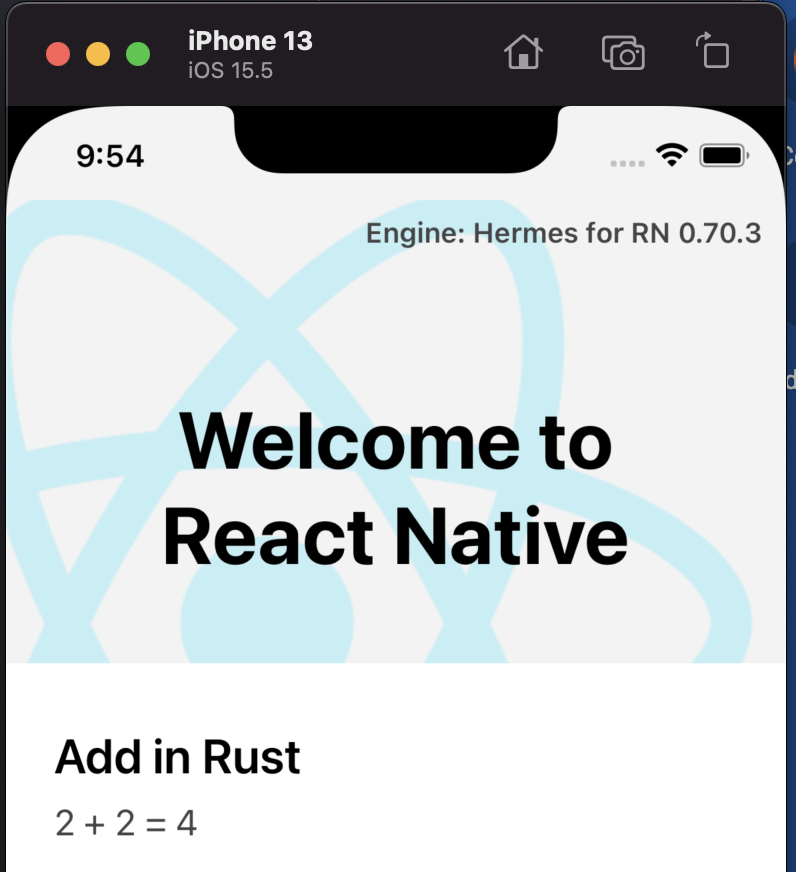

## Rust + React Native

That is an extremely simple (and incorrect in many ways) PoW on how to connect Rust code and React Native.

The inspirations were:
1. https://github.com/Terrahop/react-native-rust-demo
2. https://github.com/inokawa/react-native-wasm
3. https://github.com/inokawa/react-native-react-bridge

First, I wanted to compile Rust to wasm and use it within React Native, but the only reasonable way was to do it inside WebView.
That looked extraordinarily wrong and, from the perspective of security and maintainability, looked like an abysmal choice.

Hence, I decided to create C bindings in the Rust library. Those bindings are consumed via JSI Module and bridged via JSI to JavaScript.
For now, this works only on iOS and only on the simulator. Adding support for the actual iPhone is not problematic, but adding support for Android requires additional effort.
[react-native-rust-demo](https://github.com/Terrahop/react-native-rust-demo) looked promising, but I wanted to use JSI binding to have fast, synchronous calls and maintain more control over the flow.


## How to run?
RN setup:
```bash
yarn 
cd ios && pod install && cd ..
yarn react-native start
```

Compile library
```bash
cd rust
rustup target add x86_64-apple-ios-sim
cargo build --target x86_64-apple-ios
cd ..
```

Compile app
```bash
yarn react-native run-ios
```



